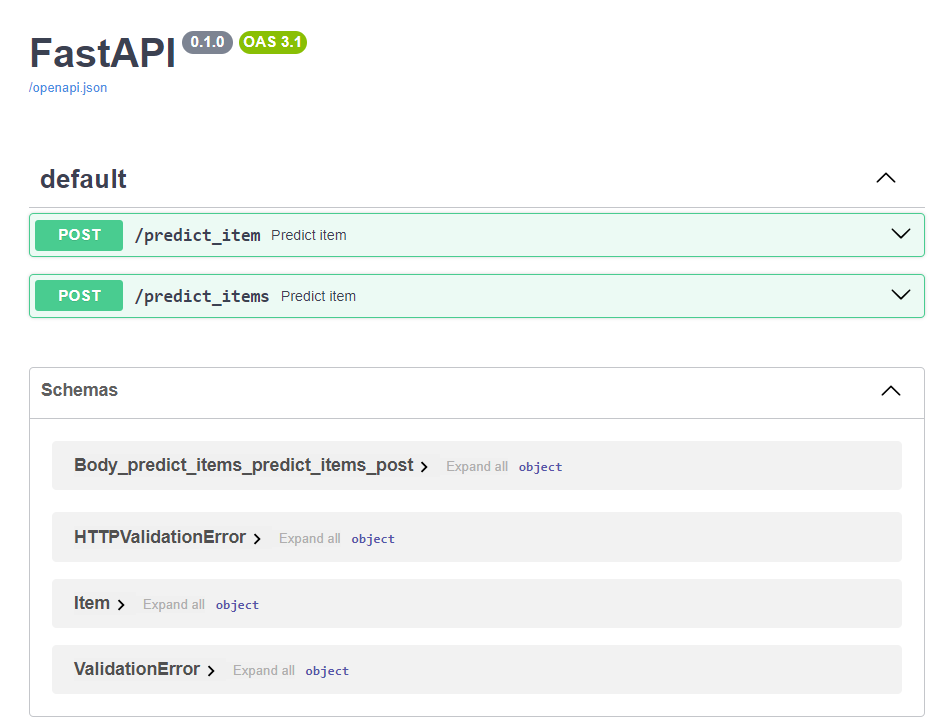
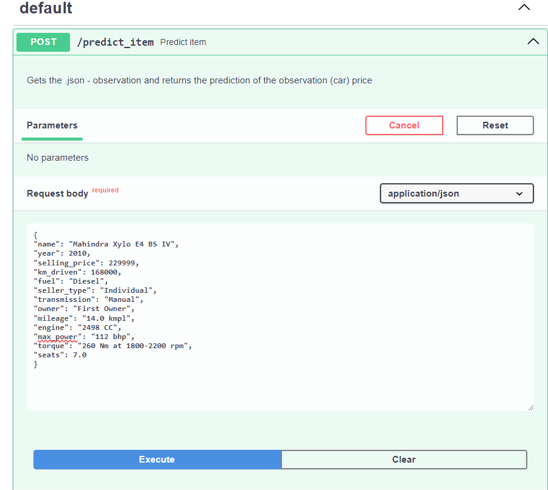
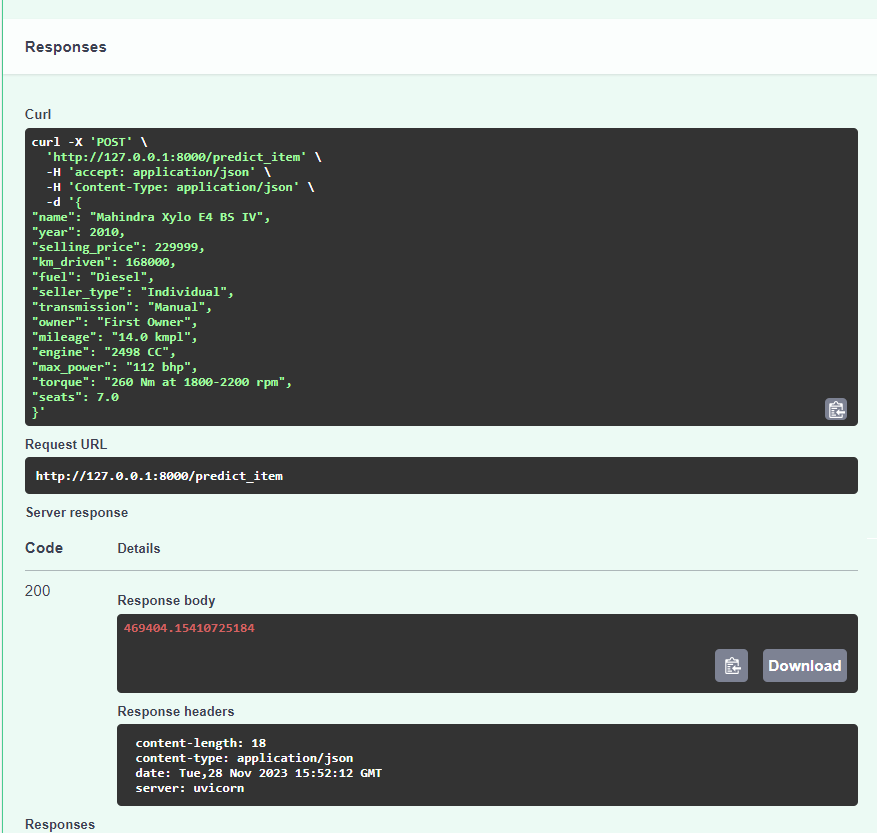
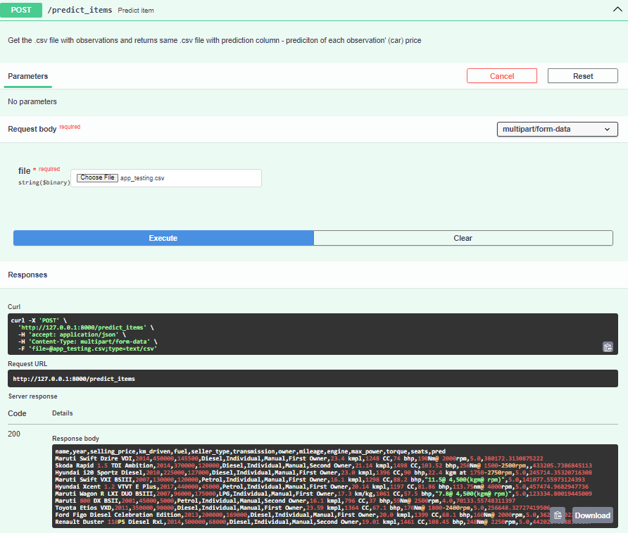

# ml_hw1

**Что было сделано**:  
 - Preprocessing:
    * Были очищены данные от пропусков   
    * Были очищены данные от дубликатов   
    * Были обработаны столбцы mileage, engine, max_power (приведены к float)    
    * Были дропнуты столбцы torque и name    
 - EDA:   
    * Выяснилось, что целевая переменная и некоторые признаки, примерно, подчиняются лог-нормальному распределению    
    * Выяснилось, что между целевой переменной и признаками есть как линейные, так и нелинейные зависимости   
    * Выяснилось, что категориальные переменные важны для предсказания целевой переменной   
- Feature engineering:    
    * Для кодирования категориальных переменных было использовано Mean Target Encoding (с зашумлением и кросс-валидацией)   
    *  Были логарифмированы selling_price, km_driven, max_power
    *  Были отнормированы данные с помощью StandardScaler
    *  Были сгенерированы полиномиальные фичи и перемножения фичей степени 3 и меньше и, впоследствии, выбраны наиболее важные для модели фичи (позволило сократить количество фичей в 3 раза)
- Model:     
    * RidgeRegression c дефолтным параметром alpha=1 (большого смысла его подбирать нет)    

**Результаты лучшей модели**:    
 - Train R**2: 0.8378    
 - Train MSE (log): 0.0947    
 - Test R**2: 0.8624       
 - Test MSE (log): 0.0983    

**Что дало наибольший буст в качестве**:   
 - Логарифмирование целевой переменной   
 - Использование категориальных фичей (в виде MTE или OHE)   
 - Использование полиномов фичей

**Что сделать не вышло и почему**:
 - Улучшить качество засчет использования MTE, вместо OHE (зато существенно сократило количество генерируемых фичей на этапе генерирвоания полиномов)  
 - Что потенциально можно было сделать, если бы у меня было больше времени:
    * Спарсить дполнительные данные по автомобилям
    * Заполнить пропуски с помщью построения ML модели
    * В данных не мало выбросов, можно было бы как-то поиграться  с этим 

**Скриншоты работы сервиса**:

